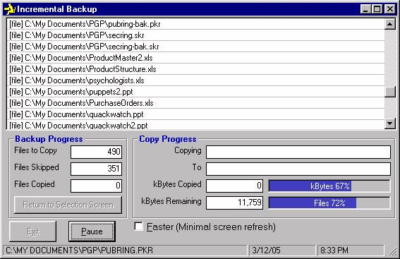



## Incremental Backup Phase Two

### Description

This is a modified version of "Incremental Backup" found here at PSC. This program allows one to backup from a folder and its subfolders to another folder, building destination folder structures where needed. The code checks for date last modified and only backs up newer files. This is much quicker than a "copy and paste". Vestigial files will remain in the backup folder and this can be very useful. Thanks to other PSC contributors including Pietro Cecchi whose .bas module I used. I have used a MSFlexGrid control to hold the file list, which means one may queue tens of thousands of files for backup (superior to the ListBox control); one may also now resize the form, pause execution, and limit screen refresh to help speed up file backup.
 
### More Info
 

             |
---                |---
**Submitted On**   |2005-03-12 20:31:16
**By**             |[David M Rice](https://github.com/Planet-Source-Code/PSCIndex/blob/master/ByAuthor/david-m-rice.md)
**Level**          |Intermediate
**User Rating**    |4.0 (8 globes from 2 users)
**Compatibility**  |VB 5\.0, VB 6\.0
**Category**       |[Files/ File Controls/ Input/ Output](https://github.com/Planet-Source-Code/PSCIndex/blob/master/ByCategory/files-file-controls-input-output__1-3.md)
**World**          |[Visual Basic](https://github.com/Planet-Source-Code/PSCIndex/blob/master/ByWorld/visual-basic.md)
**Archive File**   |[Incrementa1864063132005\.ZIP](https://github.com/Planet-Source-Code/david-m-rice-incremental-backup-phase-two__1-59456/archive/master.zip)

